# OS Jackfruit: Multi-Container Runtime

## Team Information

- Member 1: `H K Manaswin` - `PES1UG24AM108`
- Member 2: `Harshith R` - `PES1UG24AM117`

## Project Summary

This project implements a lightweight Linux container runtime in C with a long-running supervisor and a kernel-space memory monitor. The runtime can manage multiple containers concurrently, expose a CLI over a UNIX domain socket, capture container output through a bounded-buffer logging pipeline, and run controlled scheduling experiments. The kernel module tracks registered container host PIDs, logs a soft-limit warning on first RSS breach, and enforces a hard limit with `SIGKILL`.

## Repository Contents

- `engine.c`: user-space supervisor daemon and CLI client
- `monitor.c`: Linux kernel memory monitor module
- `monitor_ioctl.h`: shared `ioctl` definitions
- `cpu_hog.c`: CPU-bound workload
- `io_pulse.c`: I/O-bound workload
- `memory_hog.c`: memory pressure workload
- `Makefile`: full build for user-space binaries and kernel module
- `boilerplate/`: CI-safe build path for `make -C boilerplate ci`
- `TEST_CASES.md`: test scenarios and expected outcomes
- `PROJECT_SUMMARY.md`: concise project overview

## Environment and Setup

This project is designed for:

- Ubuntu 22.04 or 24.04 in a VM
- Secure Boot OFF
- No WSL for final evaluation

### Install Dependencies

```bash
sudo apt update
sudo apt install -y build-essential linux-headers-$(uname -r) wget mokutil
```

### Environment Preflight

```bash
cd boilerplate
chmod +x environment-check.sh
sudo ./environment-check.sh
cd ..
```

### CI-Safe Smoke Build

```bash
make -C boilerplate ci
```

## Build, Load, and Run Instructions

### 1. Build Everything

```bash
make
```

### 2. Prepare Root Filesystems

```bash
mkdir rootfs-base
wget -4 https://dl-cdn.alpinelinux.org/alpine/v3.20/releases/x86_64/alpine-minirootfs-3.20.3-x86_64.tar.gz
tar -xzf alpine-minirootfs-3.20.3-x86_64.tar.gz -C rootfs-base

cp -a ./rootfs-base ./rootfs-alpha
cp -a ./rootfs-base ./rootfs-beta
```

### 3. Copy Workloads Into Rootfs Copies

```bash
cp ./cpu_hog ./rootfs-alpha/
cp ./memory_hog ./rootfs-alpha/
cp ./io_pulse ./rootfs-beta/
```

For extra experiments, create fresh writable copies:

```bash
cp -a ./rootfs-base ./rootfs-cpu1
cp -a ./rootfs-base ./rootfs-cpu2
cp -a ./rootfs-base ./rootfs-io1
cp ./cpu_hog ./rootfs-cpu1/
cp ./cpu_hog ./rootfs-cpu2/
cp ./io_pulse ./rootfs-io1/
```

### 4. Load the Kernel Module

```bash
sudo insmod monitor.ko
ls -l /dev/container_monitor
dmesg | tail -n 20
```

### 5. Start the Supervisor

```bash
sudo ./engine supervisor ./rootfs-base
```

### 6. Use the CLI

```bash
sudo ./engine start alpha ./rootfs-alpha /bin/sh --soft-mib 48 --hard-mib 80
sudo ./engine start beta ./rootfs-beta /bin/sh --soft-mib 64 --hard-mib 96 --nice 5
sudo ./engine ps
sudo ./engine logs alpha
sudo ./engine stop alpha
sudo ./engine stop beta
```

### 7. Foreground Workload Runs

```bash
sudo ./engine run memSoft ./rootfs-alpha "/memory_hog 72 20" --soft-mib 48 --hard-mib 128
sudo ./engine run memHard ./rootfs-alpha "/memory_hog 96 20" --soft-mib 48 --hard-mib 64
```

### 8. Cleanup

```bash
sudo ./engine stop alpha
sudo ./engine stop beta
ps aux | grep defunct
sudo rmmod monitor
dmesg | tail -n 20
```

## CLI Contract Implemented

```bash
engine supervisor <base-rootfs>
engine start <id> <container-rootfs> <command> [--soft-mib N] [--hard-mib N] [--nice N]
engine run <id> <container-rootfs> <command> [--soft-mib N] [--hard-mib N] [--nice N]
engine ps
engine logs <id>
engine stop <id>
```

Default limits:

- Soft limit: `40 MiB`
- Hard limit: `64 MiB`

## Task Coverage

### Task 1: Multi-Container Runtime with Supervisor

- `clone()` launches children with `CLONE_NEWPID`, `CLONE_NEWUTS`, and `CLONE_NEWNS`
- Each live container uses its own writable rootfs copy
- The child uses `chroot()` into the assigned rootfs
- `/proc` is mounted inside the container mount namespace
- The supervisor stays alive while multiple containers run
- User-space metadata tracks ID, host PID, state, limits, start time, log path, and exit status

### Task 2: CLI and Signal Handling

- The control-plane IPC uses a UNIX domain socket
- CLI commands reach the long-running supervisor correctly
- `ps`, `logs`, `start`, `run`, and `stop` are supported
- The supervisor reaps child processes in the background
- `stop` sets `stop_requested` before signaling the container
- Final metadata distinguishes normal exit, manual stop, and hard-limit kill

### Task 3: Bounded-Buffer Logging and IPC Design

- Each container's `stdout` and `stderr` are redirected into pipes
- Producer threads read from those pipes
- A bounded shared queue separates producers from the log writer
- A consumer thread writes log data into per-container files under `./logs`
- Synchronization uses mutexes and condition variables

### Task 4: Kernel Memory Monitoring

- The module registers `/dev/container_monitor`
- The supervisor sends host PIDs and memory limits through `ioctl`
- The module stores tracked processes in a lock-protected linked list
- A kernel thread checks RSS periodically
- The first soft-limit breach logs a warning
- Hard-limit breach kills the process with `SIGKILL`

### Task 5: Scheduler Experiments

The runtime was used for:

1. CPU vs CPU with different `nice` values
2. CPU vs IO workload coexistence

### Task 6: Resource Cleanup

- Child reaping is handled by the supervisor
- Logging threads exit when pipe endpoints close
- Log files remain available for inspection
- The module unregisters exited or stale PIDs
- Final cleanup was verified with `rmmod` and `ps aux | grep defunct`

## Demo with Screenshots

### 1. Build Success

Caption: Full build and CI-safe smoke build completed, producing `engine`, `monitor.ko`, and all workload binaries.

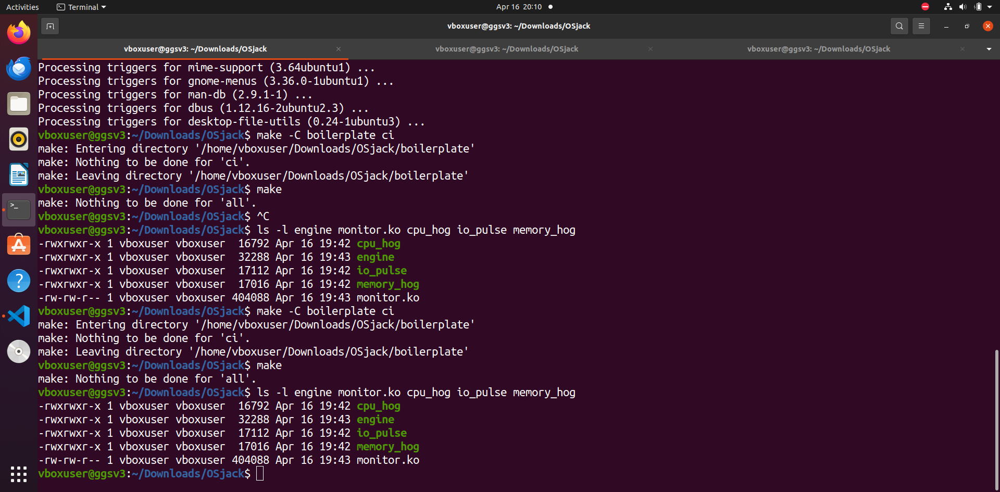

### 2. Rootfs Preparation

Caption: Alpine minirootfs downloaded and expanded, then copied into separate writable rootfs directories for different containers.

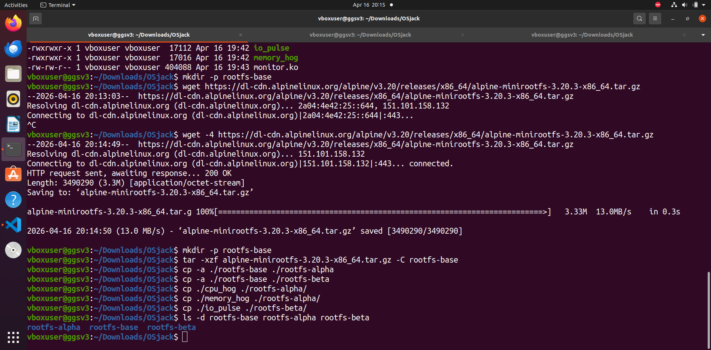

### 3. Control Device and Module Load

Caption: The kernel module was inserted successfully and created `/dev/container_monitor`.

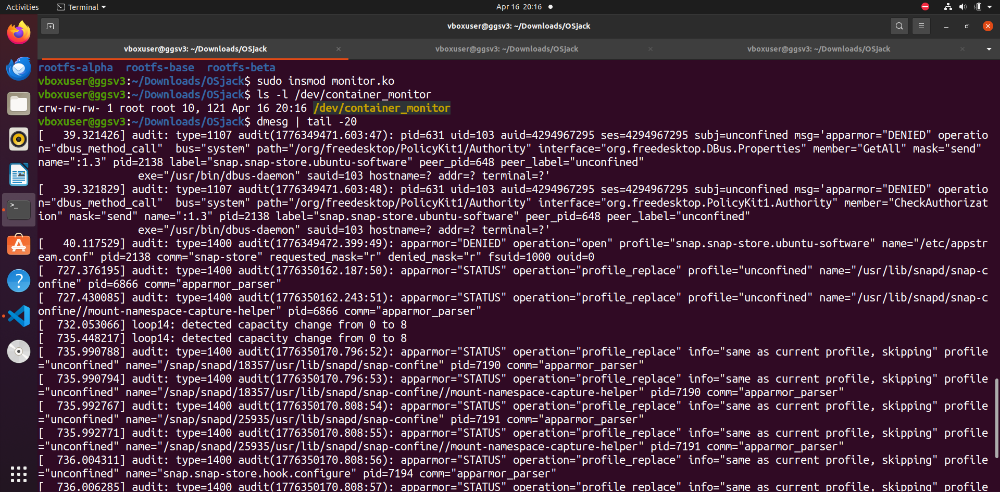

### 4. Supervisor Startup

Caption: The long-running supervisor process started and listened on `/tmp/osjackfruit_supervisor.sock`.

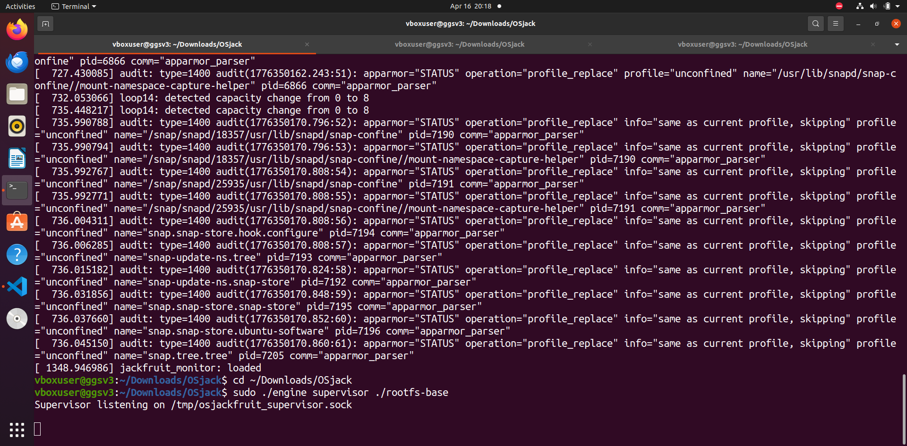

### 5. Multi-Container Supervision and Metadata Tracking

Caption: Two containers, `alpha` and `beta`, were started under one supervisor, and `engine ps` shows their tracked metadata.

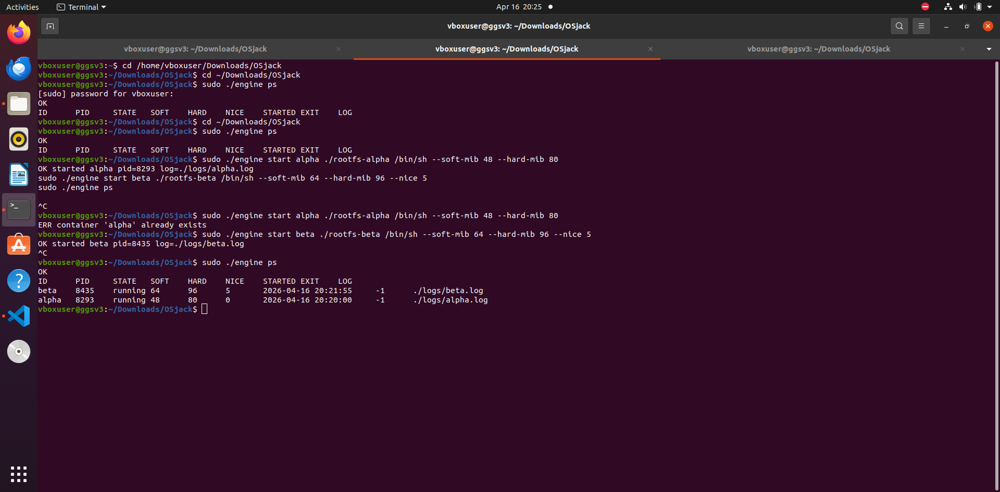

### 6. CLI and Logging Pipeline

Caption: CLI commands were issued to the supervisor, log retrieval worked, and metadata was updated after foreground runs.

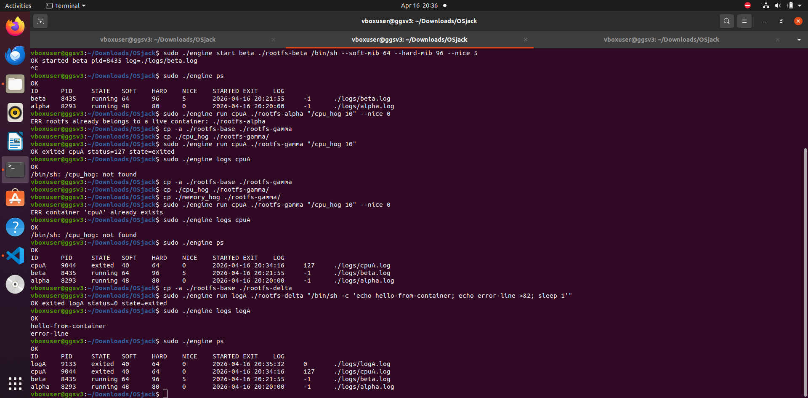

### 7. Soft-Limit Warning and Hard-Limit Enforcement

Caption: Kernel logs show registration, soft-limit warning for `memSoft`, and hard-limit kill for `memHard`.

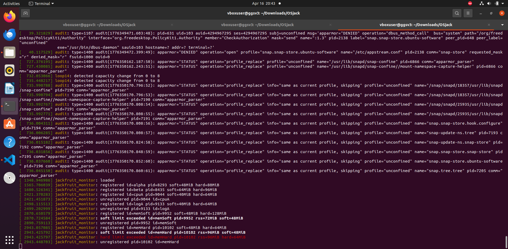

### 8. Supervisor Metadata Reflecting Hard-Limit Kill

Caption: User-space metadata shows `memHard` as `hard_limit_killed`, while logs remain available for inspection.

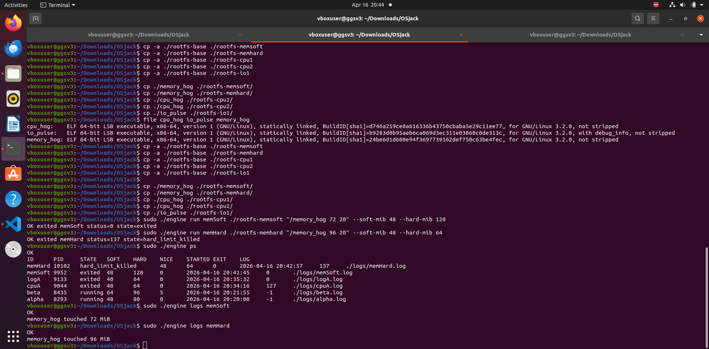

### 9. Scheduling Experiment: CPU vs CPU

Caption: Two CPU-bound containers with different `nice` values completed successfully, and their logs were compared.

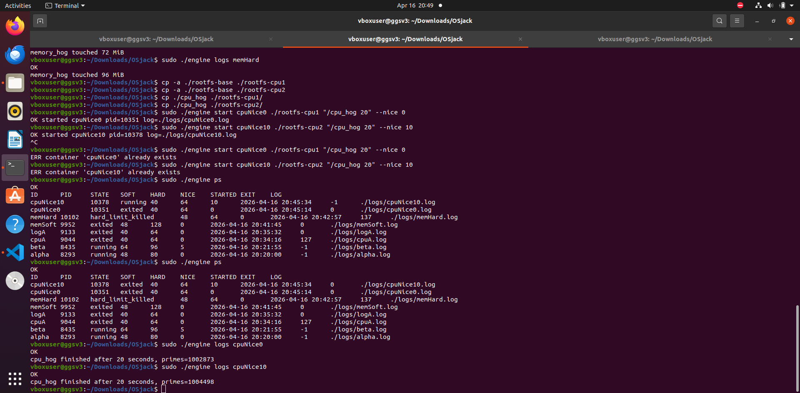

### 10. Scheduling Experiment: CPU vs IO

Caption: CPU-bound and I/O-bound workloads ran concurrently; both completed and their outputs were captured.

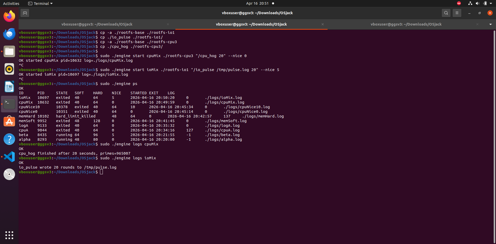

### 11. Clean Teardown

Caption: The kernel module was unloaded successfully and no zombie processes were present in `ps aux | grep defunct`.

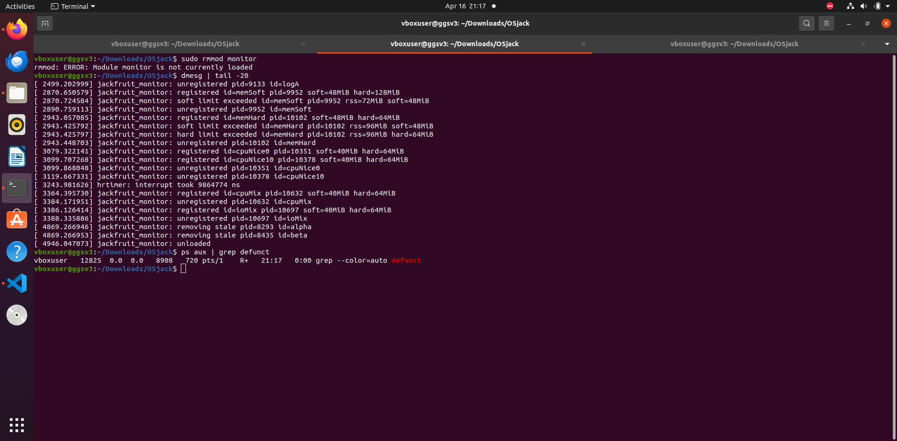

## Scheduler Experiment Results

| Experiment | Setup | Measurement | Observation |
| --- | --- | --- | --- |
| CPU vs CPU | `cpuNice0` with `--nice 0` and `cpuNice10` with `--nice 10` | Both completed successfully; logs showed about `1002873` primes for `cpuNice0` and `1004498` for `cpuNice10` over 20 seconds | The difference was small in this VM run, likely influenced by staggered launch timing and VM scheduling noise. The experiment still demonstrates configurable priority and concurrent CPU-bound execution inside the runtime. |
| CPU vs IO | `cpuMix` using `/cpu_hog 20` and `ioMix` using `/io_pulse /tmp/pulse.log 20` | `cpuMix` finished with about `965007` primes; `ioMix` wrote `20` rounds successfully | The I/O-bound workload stayed responsive and completed its bursty writes while the CPU-bound task continued computing, illustrating different scheduler treatment of CPU-heavy and sleep-heavy workloads. |

## Engineering Analysis

### 1. Isolation Mechanisms

The runtime uses Linux namespaces to isolate each container's PID space, hostname, and mount view. `CLONE_NEWPID` gives the child its own PID namespace, `CLONE_NEWUTS` isolates the hostname, and `CLONE_NEWNS` allows the container to make mount changes without affecting the host's mount tree. Filesystem isolation is implemented with `chroot()` into a separate writable rootfs copy, and `/proc` is mounted inside that namespace so process tools work relative to the container's PID view. The host kernel is still shared across all containers, which means scheduling, memory management, and kernel code remain global.

### 2. Supervisor and Process Lifecycle

A long-running supervisor is useful because it centralizes container creation, metadata tracking, signal handling, child reaping, and log ownership. Each CLI invocation is short-lived and only sends a request over the control channel; the supervisor remains responsible for the full lifecycle. This keeps container management consistent across multiple commands. Without a persistent parent process, it would be harder to avoid zombies, harder to preserve metadata after exit, and harder to coordinate stop flows and cleanup.

### 3. IPC, Threads, and Synchronization

The project uses two IPC mechanisms. The control path uses a UNIX domain socket between CLI clients and the supervisor. The logging path uses pipes from container `stdout` and `stderr` into the supervisor. These are intentionally different, which matches the assignment requirement and separates control traffic from output traffic.

The logging pipeline uses a bounded producer-consumer design. Producer threads read bytes from pipe file descriptors and push them into a fixed-size shared queue. A consumer thread removes entries and flushes them into per-container log files. Mutexes protect both the queue and the shared container metadata list. Condition variables are used so producers wait when the queue is full and the consumer waits when it is empty. Without these synchronization primitives, the design would risk corrupted queue state, interleaved or lost log data, race conditions in metadata updates, and possible deadlock or busy-wait behavior.

### 4. Memory Management and Enforcement

RSS represents resident physical memory pages currently mapped by the process. It does not equal the full virtual address space size, and it does not capture every kernel-side cost associated with a process. Soft and hard limits are different policies because they support different goals. A soft limit is observational and gives a warning signal without immediately stopping the workload. A hard limit is an enforcement threshold and terminates the process once memory use becomes unacceptable.

This policy belongs in kernel space because the kernel can inspect live process memory usage directly and deliver signals reliably. A user-space-only monitor would be weaker because it depends on polling delays, races with process exit, and less direct access to authoritative memory accounting.

### 5. Scheduling Behavior

The scheduler experiments use the runtime as a controlled platform rather than trying to reimplement Linux scheduling. In the CPU-vs-CPU experiment, both workloads completed successfully under different `nice` values, demonstrating that the runtime can launch concurrent CPU-bound processes with different priority settings. In the CPU-vs-IO experiment, the I/O workload remained responsive and finished its write rounds while the CPU-bound task continued computing. This aligns with Linux scheduling goals: keep interactive or bursty tasks responsive, share CPU time fairly under contention, and preserve throughput for compute-heavy workloads.

## Design Decisions and Tradeoffs

- `clone()` with namespace flags plus `chroot()` was chosen instead of a more complex `pivot_root()` flow because it is easier to reason about and sufficient for the assignment.
- A long-running supervisor was chosen over per-command direct launches because it simplifies metadata retention, cleanup, and multi-container coordination.
- A UNIX socket was chosen for control IPC while logs use pipes, keeping the two communication paths distinct and aligned with the specification.
- A bounded queue was chosen for logs to prevent unbounded memory growth while still allowing concurrent producers and a dedicated consumer.
- The memory policy is split into soft and hard limits to support both observability and enforcement.

## Cleanup Notes

The final teardown run showed:

- stale/exited PIDs removed from the module list
- successful module unload
- no zombie processes in `ps aux | grep defunct`

